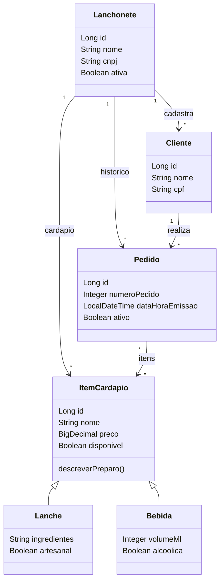

# Lanchonete API

API REST em Spring Boot para gestão de uma lanchonete: cadastro de lanchonetes, clientes, cardápio (lanches e bebidas) e pedidos.

Projeto da disciplina **Desenvolvimento de Aplicações Java com Spring Boot** — Pós-graduação em Engenharia de Software com Java (INFNET).


---

## Por que usar

- **CRUD completo** (`POST`, `GET`, `PUT`, `PATCH`, `DELETE`) em seis recursos de domínio.
- **Validação declarativa** com Bean Validation, incluindo `@CPF` e `@CNPJ` do Hibernate Validator.
- **Tratamento de erro centralizado** via `@RestControllerAdvice`, com resposta JSON padronizada.
- **Documentação viva** com Swagger UI (springdoc-openapi) — todos os endpoints anotados com `@Operation`.
- **Banco em memória H2** com console web: sobe e roda sem instalar nada.

---

## Stack

| Camada | Tecnologia |
|---|---|
| Linguagem | Java 17 |
| Framework | Spring Boot 4.1.0 (Web MVC, Data JPA, Validation) |
| Persistência | Spring Data JPA + Hibernate |
| Banco | H2 (in-memory) |
| Documentação | springdoc-openapi 2.8.9 (Swagger UI) |
| Build | Maven (wrapper incluso) |

---

## Instalação

Pré-requisitos: **JDK 17 ou superior** e Git. O Maven não precisa ser instalado — use o wrapper (`mvnw`).

```bash
git clone https://github.com/Viniciusrz7/Trabalho-INFNET-Disciplina-Desenvolvimento-de-aplica-es-Java-com-Spring-Boot-.git
cd Trabalho-INFNET-Disciplina-Desenvolvimento-de-aplica-es-Java-com-Spring-Boot-/vinicius_reis_zimmermann-trabalho-java
```

Verifique a versão do JDK:

```bash
java -version
```

---

## Quickstart

Suba a aplicação:

```bash
# Linux / macOS
./mvnw spring-boot:run
```

```powershell
# Windows (PowerShell / cmd)
.\mvnw.cmd spring-boot:run
```

A API sobe em `http://localhost:8080`. Acesse:

| Recurso | URL |
|---|---|
| Swagger UI | http://localhost:8080/swagger-ui.html |
| OpenAPI (JSON) | http://localhost:8080/v3/api-docs |
| Console H2 | http://localhost:8080/h2-console |

Credenciais do console H2 — JDBC URL `jdbc:h2:mem:vinicius_reis_zimmermann`, usuário `sa`, senha em branco.

> [!NOTE]
> O banco é **in-memory** com `ddl-auto=create-drop`: o schema é recriado a cada start e todos os dados são perdidos ao parar a aplicação.

---

## Usando a API

### 1. Cadastrar uma lanchonete

A lanchonete é a raiz do domínio — clientes, itens de cardápio e pedidos pertencem a ela.

```bash
curl -X POST http://localhost:8080/lanchonetes \
  -H "Content-Type: application/json" \
  -d '{
        "nome": "Super Lanches",
        "cnpj": "12.345.678/0001-95",
        "ativa": true
      }'
```

```json
{ "id": 1, "nome": "Super Lanches", "cnpj": "12.345.678/0001-95", "ativa": true }
```

### 2. Cadastrar um lanche no cardápio

```bash
curl -X POST http://localhost:8080/lanches \
  -H "Content-Type: application/json" \
  -d '{
        "nome": "X-Tudo Artesanal",
        "preco": 35.50,
        "disponivel": true,
        "ingredientes": "Pão brioche, blend 200g, queijo, bacon, ovo",
        "artesanal": true,
        "lanchonete": { "id": 1 }
      }'
```

### 3. Consultar o cardápio

```bash
curl http://localhost:8080/lanches/disponiveis
curl "http://localhost:8080/lanches/busca?nome=tudo"
```

> [!TIP]
> A busca por nome exige **no mínimo 3 caracteres** (`Validation.validarTermo`); abaixo disso a API retorna `400 Bad Request`.

### 4. Atualização parcial

```bash
curl -X PATCH http://localhost:8080/lanches/1 \
  -H "Content-Type: application/json" \
  -d '{ "preco": 39.90 }'
```

---

## Endpoints

Recursos de cardápio — `/itemcardapios`, `/lanches`, `/bebidas`:

| Método | Rota | Descrição |
|---|---|---|
| `POST` | `/{recurso}` | Inclui um item (retorna `201` + header `Location`) |
| `GET` | `/{recurso}` | Lista todos |
| `GET` | `/{recurso}/disponiveis` | Lista apenas os disponíveis |
| `GET` | `/{recurso}/{id}` | Busca por identificador |
| `GET` | `/{recurso}/busca?nome=` | Busca por trecho do nome (mín. 3 caracteres) |
| `PUT` | `/{recurso}/{id}` | Substitui todos os dados |
| `PATCH` | `/{recurso}/{id}` | Altera apenas os campos informados |
| `DELETE` | `/{recurso}/{id}` | Exclui (retorna `204`) |

Demais recursos:

| Rota | Operações | Observação |
|---|---|---|
| `/lanchonetes` | `POST`, `GET`, `GET /{id}`, `GET ?nome=`, `PUT /{id}`, `PATCH /{id}`, `DELETE /{id}` | CRUD completo |
| `/clientes` | `POST`, `GET`, `GET ?nome=`, `PUT /{id}`, `PATCH /{id}`, `DELETE /{id}` | Sem `GET /{id}` |
| `/pedidos` | `POST`, `GET`, `GET /{id}`, `PUT /{id}`, `PATCH /{id}`, `DELETE /{id}` | CRUD completo |

---

## Modelo de domínio



`ItemCardapio` é uma entidade **abstrata** mapeada com `@Inheritance(strategy = JOINED)`; `Lanche` e `Bebida` são as especializações concretas e implementam `descreverPreparo()`.

---

## Tratamento de erros

`GlobalExceptionHandler` converte exceções em um corpo JSON uniforme:

```json
{
  "status": 400,
  "erro": "Bad Request",
  "mensagem": "preco: O preço deve ser maior que zero; nome: O nome é obrigatório",
  "dataHora": "2026-08-29T14:05:12.482"
}
```

| Exceção | HTTP |
|---|---|
| `MethodArgumentNotValidException` (falha de `@Valid`) | `400 Bad Request` |
| `IllegalArgumentException` | `400 Bad Request` |
| `RecursoNaoEncontradoException` | `404 Not Found` |
| `IdentificadorDuplicadoException` | `409 Conflict` |

---

## Configuração

Todas as chaves ficam em [`src/main/resources/application.properties`](src/main/resources/application.properties):

| Propriedade | Padrão | Função |
|---|---|---|
| `spring.datasource.url` | `jdbc:h2:mem:vinicius_reis_zimmermann` | URL do H2 em memória |
| `spring.jpa.hibernate.ddl-auto` | `create-drop` | Recria o schema a cada start |
| `spring.jpa.show-sql` | `true` | Loga o SQL gerado pelo Hibernate |
| `spring.h2.console.enabled` | `true` | Habilita o console web do H2 |
| `spring.h2.console.path` | `/h2-console` | Caminho do console |
| `app.runner.enabled` | `false` | Liga a carga de demonstração do `ProjetoRunner` |

### Carga de demonstração

`ProjetoRunner` é um `CommandLineRunner` que popula dados de exemplo e imprime no console uma demonstração das operações do repositório JPA (`saveAll`, `findAll`, `findById`, `deleteById`, `count`). Está desligado por padrão:

```bash
./mvnw spring-boot:run -Dspring-boot.run.arguments=--app.runner.enabled=true
```

---

## Desenvolvimento

```bash
./mvnw clean compile     # compila
./mvnw test              # roda a suíte de testes
./mvnw package           # gera o JAR executável em target/
java -jar target/vinicius_reis_zimmermann-trabalho-java-0.0.1-SNAPSHOT.jar
```

### Estrutura do projeto

```
src/main/java/br/edu/infnet/
├── ViniciusApiApplication.java     # classe de bootstrap
├── ProjetoRunner.java              # carga de demonstração (opcional)
├── controller/                     # @RestController — camada HTTP
├── service/                        # regras de negócio
│   └── validation/                 # validações compartilhadas
├── repository/                     # interfaces Spring Data JPA
├── model/domain/                   # entidades JPA
└── exception/                      # exceções e handler global
```

### Estado atual dos testes

`ApiRoutesIntegrationTest` cobre 4 cenários com MockMvc. **Os 4 falham na versão atual** — descrevem o comportamento desejado, ainda não implementado.

---

## Contribuindo

1. Faça um fork e crie uma branch a partir de `main`: `git checkout -b feat/minha-mudanca`.
2. Garanta que o projeto compila: `./mvnw clean compile`.
3. Rode os testes: `./mvnw test`.
4. Use mensagens de commit no padrão [Conventional Commits](https://www.conventionalcommits.org/pt-br/) (`feat:`, `fix:`, `docs:`, `refactor:`).
5. Abra um Pull Request descrevendo a mudança e o que foi testado.

---

## Licença

Projeto acadêmico desenvolvido para a disciplina Desenvolvimento de Aplicações Java com Spring Boot do Instituto Infnet. Uso educacional.

## Autor

**Vinicius Reis Zimmermann** — [@Viniciusrz7](https://github.com/Viniciusrz7)
